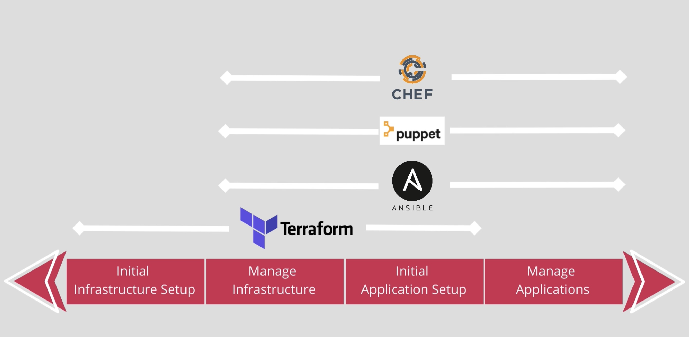

# Instructions to run

* To run development environment:

```
terraform apply -var-file "terraform-dev.tfvars"
```

* To run staging environment:

```
terraform apply -var-file "terraform-staging.tfvars"
```

* To run production environment:

```
terraform apply -var-file "terraform-production.tfvars"
```


